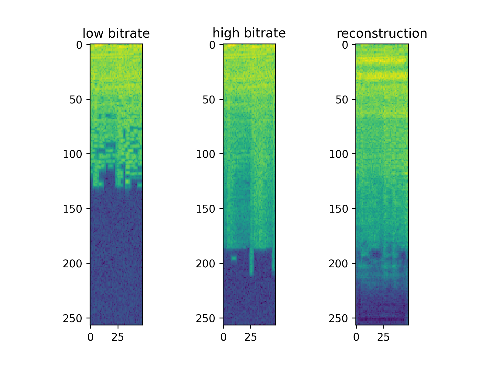

# Using GANs to restore low-bitrate MP3s
## Usage:
Copy a bunch of good-sounding mp3's into data/mp3_high
Run the convert.py tool to re-encode them into garbage-sounding 64kbps MP3s

Run restorer/train.py to train a GAN that tries to reconstruct portions of the low-bitrate MP3s in the frequency domain.

Currently, it sounds pretty okay after training for a while, but some MP3 artifacting remains.

Here's an example reconstruction of the spectrogram (x is the low-bitrate mp3, y is the high-bitrate mp3, and o is the reconstruction of the low-bitrate mp3):

More to come!
